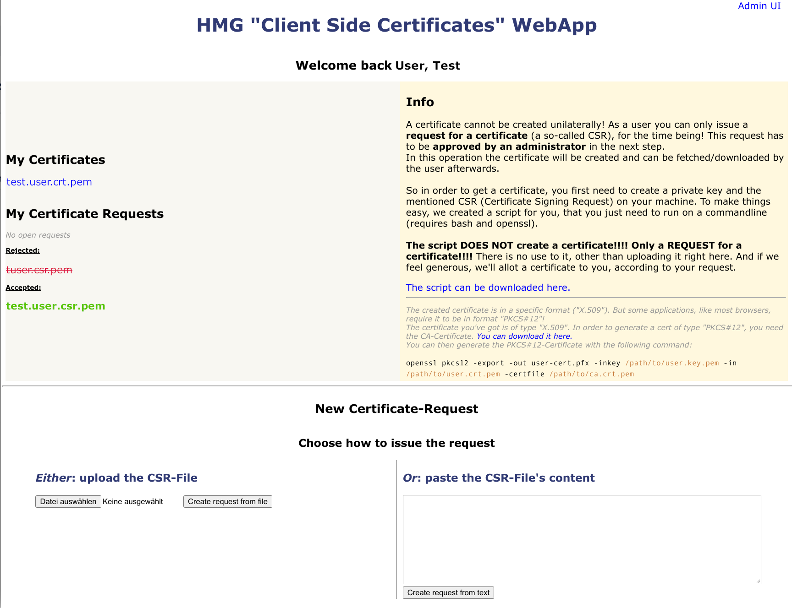

# Client Certificate Webapp
## Motivation
Having an IP-Whitelist in order to manage access to your internal Services/Website, is a somewhat dated concept.
And it comes with several issues. Like: what about developers in home-office?

But authentication via certificates is of course more complicated. Especially for the users!
The reason is, that they just want to access the service, and for all what they know, 
this usually involves entering a username and password.
But with certificates one can do so much more - and its necessary to hide this complexity, and make using them
as easy as possible. 

Now, when you search around the internet for "certificate management" or the like, you'll find a bunch of software,
that makes things more complicated, rather than less.

## Purpose
The app should enable the user to get, or at least request, a persona certificate with as few actions as possible.
On the administrative side, there shall be an overview of the pending requests as well as the already signed one.
Signing a request shall be as easy as "enter a password and push the button"!
All actions (signing, revocation...) should be versioned - so it suggests itself to use git, to store the certificates and other data.

## Requirements
* In order for a user to requests a certificate, it must be ensured, that the user is authenticated - meaning, its identity must be verified!
* You may also want to make sure, that the identified user is indeed authorized to request a new certificate!
* It must be easy for the user to create a CSR (Certificate Signing Request) - a script with some sane defaults seem appropriate.
* The user must be able to just upload the CSR
* Downloading the certificate - once it has been signed - must be similarly easy.
* If the Request has been rejected, the user must be able to notice that.
* There must be a description, how to get the certificate into the browser of the user.
* Pending request must be listed on the admin-page (with details)
* Signed requests must be listed on the admin-page
* Certificates and the whole openssl-stuff shall be stored in a git-repository
* It must be possible to encrypt the data, to avoid having plain-text data about the users in the git-repository


## Implementation and preconditions
The app does not setup the openssl-repository for you - see below, how to achieve that.

Spring-Boot is used as framework. 
Authentication is done using spring-security-oauth2 combined with azure-spring-boot - so an **Azure AD** is required.

The application runs happily in a docker-container within AKS (Azure Kubernetes Service).

Most openssl-actions are done by invoking the native command - because its more simply (and thus also more robust and secure) and reliable 
than using some library that might also lack some required features. 

The current implementation will always encrypt the important files (like cert, csr, keys) before committing them (and decrypt after checkout).
In order to avoid trouble with git, it always uses the same (configurable) salt - otherwise git would always assume all encrypted files as changed! 


## configuration
The Dockerfile assume the custom configuration to be located at `/opt/config/application.properties`.
You (may) need to configure at least the following properties in that file and replace the values for your needs:

```properties
data.cert-repo=ssh://git@your.git/cert/repository.git
data.git-user-keyfile=/opt/config/ci-user-ssh.key
spring.security.oauth2.client.registration.azure.client-authentication-method=post
spring.security.oauth2.client.registration.azure.client-id=00000000-0000-0000-0000-000000000000
spring.security.oauth2.client.registration.azure.client-secret=#{pki-web-aad-client-secret}#
data.cert-revocation-list-path=/data/shared/crl.list
 
azure.activedirectory.tenant-id=00000000-0000-0000-0000-000000000000
azure.activedirectory.user-group.allowed-groups=group1, group2
azure.activedirectory.active-directory-groups=group1, group2
azure.activedirectory.authority=https://login.microsoftonline.com/00000000-0000-0000-0000-000000000000/
 
spring.security.oauth2.client.provider.azure.authorization-uri=https://login.microsoftonline.com/00000000-0000-0000-0000-000000000000/oauth2/authorize
spring.security.oauth2.client.provider.azure.token-uri=https://login.microsoftonline.com/00000000-0000-0000-0000-000000000000/oauth2/token
spring.security.oauth2.client.provider.azure.user-info-uri=https://login.microsoftonline.com/00000000-0000-0000-0000-000000000000/openid/userinfo
spring.security.oauth2.client.provider.azure.jwk-set-uri=https://login.microsoftonline.com/00000000-0000-0000-0000-000000000000/discovery/keys

```


Optional properties:
```properties
# if running behind a reverse-proxy:
server.use-forward-headers=true
 
data.crypt-salt=<HEX-SALT>
```


## Screenshots




## Setup openssl repository

For a good explanation - and more important: good **configuration examples** -  of the following commands, you might want to read the following guide:
https://jamielinux.com/docs/openssl-certificate-authority/index.html

Create a proper named git-repository (e.g. `client-side-certs`) and check it out.
`cd` into the repository.

**Make sure to have proper configurations at hand!** (If not: read the above linked guide first!)

```bash
###
# create basics and ca-cert
 
mkdir certs crl newcerts private
touch index.txt
echo 1000 > serial
 
openssl genrsa -aes256 -out private/ca.key.pem 4096
# store the password in a key-vault of your choice
 
# 7300 / 365 = 20
openssl req -config openssl.cnf -key private/ca.key.pem -new -x509 -days 7300 -sha256 -extensions v3_ca -out certs/ca.cert.pem
 
 
###
# create intermediate cert
 
mkdir intermediate
cd intermediate

mkdir certs crl csr newcerts private
touch index.txt
echo 1000 > serial
echo 1000 > crlnumber
 
openssl genrsa -aes256 -out intermediate/private/intermediate.key.pem 4096

openssl req -config intermediate/openssl.cnf -new -sha256 -key intermediate/private/intermediate.key.pem -out intermediate/csr/intermediate.csr.pem
 
# sign intermediate CSR
openssl ca -config openssl.cnf -extensions v3_intermediate_ca -days 3650 -notext -md sha256 -in intermediate/csr/intermediate.csr.pem -out intermediate/certs/intermediate.cert.pem

openssl verify -CAfile certs/ca.cert.pem intermediate/certs/intermediate.cert.pem
 
cat intermediate/certs/intermediate.cert.pem certs/ca.cert.pem > intermediate/certs/ca-chain.cert.pem
 
 
###
# create CRL (certificate revocation list)
 
openssl ca -config intermediate/openssl.cnf -gencrl -out intermediate/crl/intermediate.crl.pem

```